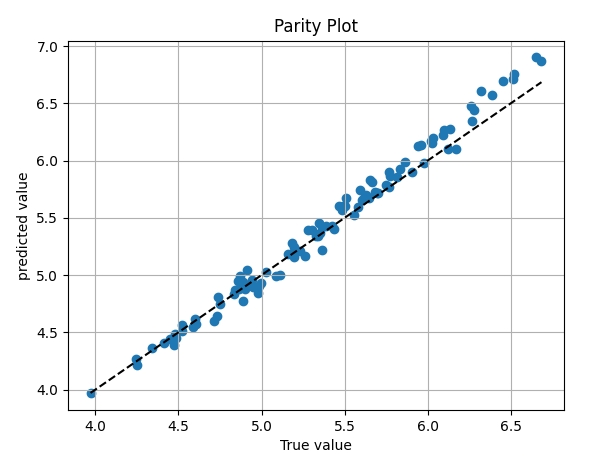
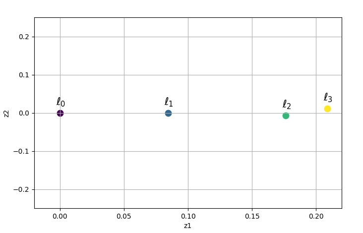

# CAGES
This repo contains the code that can reproduce experimental results in [Cost-Aware Gradient Entropy Search for Efficient Local
Multi-Fidelity Bayesian Optimization](https://arxiv.org/abs/2405.07760). The paper has been accepted to the 63rd IEEE Conference on Decision and Control (CDC)

# Codes for the repo
[cartpole](https://github.com/PaulsonLab/CAGES/blob/1c9525c7246ac3c7511f79fa02d784f689c59aed/cartpole.py) : Please replace the original cartpole.py file inside the gymnasium package (~/gymnasium/envs/classic_control/cartpole.py) with this file to enable the changes of step time (tau).\
[src\environment_api](https://github.com/PaulsonLab/CAGES/blob/48ca4862a56500a48b9537c3e8df5c0817c4a78e/src/environment_api.py): Interface for interactions with reinforcement learning environments of OpenAI Gym.\
[RL_function_new](https://github.com/PaulsonLab/CAGES/blob/bbfa02101bb79ea3856949ae180d809493f021bd/RL_function_new.py): Function that takes policy parameters and qualatative variable as input and return the reward for the RL problem.\
[test_function](https://github.com/PaulsonLab/CAGES/blob/96d4cb9009895b2f90c90823bb91f333cebe4880/test_function.py): Test problem studied in this paper, including multi-information sources Rosenbroc.

# Usage
We provide the code scripts for executing different BO algorithm including [Vanillo BO](https://botorch.org/), GIBO [[2]](https://proceedings.neurips.cc/paper_files/paper/2021/hash/ad0f7a25211abc3889cb0f420c85e671-Abstract.html), and CAGES. Augmented random search algorithm (ARS) [[3]](https://proceedings.neurips.cc/paper/2018/hash/7634ea65a4e6d9041cfd3f7de18e334a-Abstract.html) is also provided.

LVGP fitting
------------------------------
Run the following command to fit a LVGP model with specified test function and training/testing data. Example contains the multi-information sources (1 qualatative variable with 4 level) OTL function.
A parity plot and an estimated 2D LVs z = (z1, z2) plot will be generated. 
```sh
python Parity_Mapping_LVGP.py
```

User should get the following two figures by executing the above command.




Vanilla BO
------------------------------
Run the following command to execute vanilla BO with expected imrpovement. User can specify which problem (Rosenbrock, OTL, or Cartpole) to be optimized in line 31-33.

Two numpy files (EI_cost.np/EI_reward.np) will be saved in user's local directory including the accumulated cost and best found value per iteration.
```sh
python Vanilla_BO.py
```

GIBO and ARS
------------------------------
Run this following command to execute GIBO or ARS algorithm. User can specify which problem (Rosenbrock, OTL, or Cartpole) to be optimized in line 37-39 and specify GIBO or ARS in line 41.

Two numpy files (GIBO_cost.np/GIBO_reward.np) will be saved in user's local directory including the accumulated cost and best found value per iteration.
```sh
cd GIBO
python local_GIBO_exe.py
```

CAGES
------------------------------
Run the following command to execute CAGES for the multi-information Rosenbrock test problem.

Two numpy files (Rosenbrock_cost_CAGES.np/Rosenbrock_reward_CAGES.np) will be saved in user's local directory including the accumulated cost and best found value per iteration.

```sh
python CAGES_Rosenbrock.py
```

Run the following command to execute CAGES for the multi-information OTL test problem.

Two numpy files (OTL_cost_CAGES.np/OTL_reward_CAGES.np) will be saved in user's local directory including the accumulated cost and best found value per iteration.

```sh
python CAGES_OTL.py
```

Run the following command to execute CAGES for the multi-information Cartpole RL control problem.

Two numpy files (cartpole_cost_CAGES.np/cartpole_reward_CAGES.np) will be saved in user's local directory including the accumulated cost and best found value per iteration.

```sh
python CAGES_RL.py
```

Plotting Results
------------------------------
Please run the following command to load saved numpy files and generate plots. User may need to modify the path to load the file.
```sh
cd Plotting
python Plotting.py
```
Here is an example plot for the Rosenbrock problem that user can reproduce based on the np files under ~\Results\Rosenbrock:


# Reference
[1] Zhang, Y., Tao, S., Chen, W., & Apley, D. W. (2020). A latent variable approach to Gaussian process modeling with qualitative and quantitative factors. Technometrics, 62(3), 291-302.\
[2] Müller, S., von Rohr, A., & Trimpe, S. (2021). Local policy search with Bayesian optimization. Advances in Neural Information Processing Systems, 34, 20708-20720.\
[3] Mania, H., Guy, A., & Recht, B. (2018). Simple random search of static linear policies is competitive for reinforcement learning. Advances in neural information processing systems, 31.
